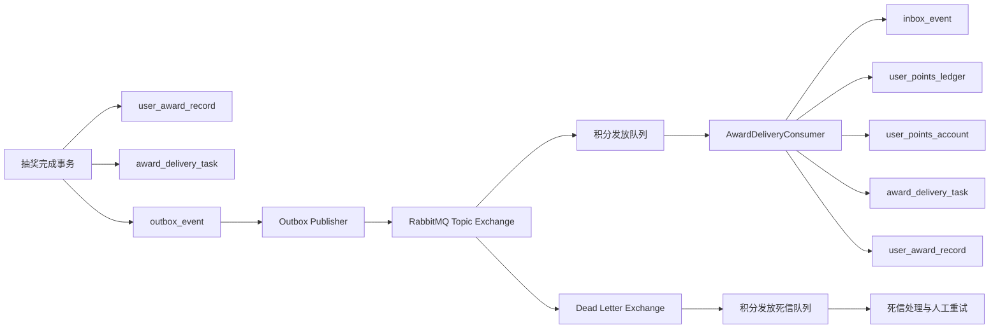

# Outbox 消息发布与积分奖异步发放设计

## 1. 文档状态

- 日期：2026-09-28
- 状态：待书面评审
- 适用项目：Big-Market 单库版本
- 目标中间件：RabbitMQ
- 前置设计：MySQL 库存桶与 Transactional Outbox

## 2. 背景与现状

Big-Market 已在抽奖完成事务中同时写入中奖记录、`award_delivery_task` 和 `AWARD_DELIVERY_REQUESTED` Outbox。积分发放由本地 `AwardDeliveryJob` 定时扫描任务表，再由 `AwardDeliveryService` 写积分流水、增加账户余额并更新发放状态。

现有实现已经具备三项正确基础：

1. 抽奖结果、发放任务和 Outbox 使用同一个 MySQL 本地事务。
2. 固定积分和随机积分都在抽奖事务中确定并固化到 `award_delivery_task.award_value`，重试不会重新计算奖励。
3. `user_points_ledger.order_id` 是业务唯一键，同一抽奖订单具备基础防重能力。

现有实现尚未形成可靠消息闭环：

- `outbox_event` 只有写入和基础查询，没有发布任务和 Publisher Confirm。
- Outbox 查询没有租约，多实例会重复领取同一记录。
- 没有 RabbitMQ 监听器、Inbox、死信队列和消息重放流程。
- 本地任务扫描和未来 MQ 消费可能形成两条发放路径。
- `user_points_ledger` 使用 `INSERT IGNORE`，可能同时掩盖非幂等类数据库错误。
- 当前消费成功依赖任务状态和积分流水，没有独立的消息级消费记录。

## 3. 目标

本次设计需要实现：

1. 抽奖事务不依赖 RabbitMQ 可用性；RabbitMQ 不可用时，中奖结果和 Outbox 仍然正常提交。
2. 多实例安全领取并发布 Outbox，进程中断后可以通过租约恢复。
3. 使用 RabbitMQ 完成积分奖品异步发放。
4. 使用 Inbox、发放任务状态和积分流水三层幂等，使重复消息不会重复增加积分。
5. 支持发布失败重试、消费失败重试、死信、人工重试和完整审计。
6. 保留本地发放模式作为开发与应急降级能力，但同一环境只能启用一种发放入口。
7. 为优惠券和实物奖品保留处理器扩展点；本阶段继续进入人工处理，不虚构外部供应商接口。

## 4. 非目标

本阶段不包含：

- 分库分表和跨分片事务。
- 优惠券中心、物流系统等外部供应商接入。
- Kafka、RocketMQ 或 RabbitMQ 事务消息。
- 全局严格有序消费。
- 将购买资格授予、退款回收等其他 Outbox 事件接入业务消费者。
- 使用 XXL-JOB 替换 Spring Scheduler。

其他 Outbox 事件继续可靠保存在 MySQL 中。发布器第一阶段只领取 `AWARD_DELIVERY_REQUESTED`，避免在下游契约尚未定义时把资格事件标记为已经发布。

## 5. 技术决策

### 5.1 选择 RabbitMQ

当前消息属于低延迟任务消费，核心诉求是 ACK、有限重试、死信和人工重放。积分增加使用原子增量，不要求不同订单严格有序。RabbitMQ 能以较低的接入和运维成本满足这些需求。

Outbox 已经解决数据库事务与消息发送之间的原子性，因此不使用 RabbitMQ 事务消息。Kafka 更适合事件流和长期回放，RocketMQ 更适合已有统一基础设施、延迟消息和更高吞吐场景，当前阶段不引入。

### 5.2 采用至少一次投递和业务结果有效一次

发布成功后应用可能在标记 Outbox 前崩溃；消费事务提交后也可能在 ACK 前崩溃。传输层重复无法完全消除，因此系统语义定义为：

- RabbitMQ：至少投递一次。
- 消费者：允许重复收到消息。
- 积分业务结果：同一个抽奖订单有效一次。

### 5.3 消息只传递定位信息

消息携带 `orderId` 和 `userId`，消费者从 `award_delivery_task` 读取奖品类型和已经固化的积分值。消费者不直接信任消息里的积分数量，也不重新读取并计算奖品配置。

### 5.4 不要求按用户严格有序

不同订单的积分增加满足交换性，数据库使用 `points = points + delta` 原子更新。`partitionKey=userId` 保留给日志、路由和未来用户共址分片，但当前正确性不依赖消息顺序。

## 6. 总体架构



## 7. 消息协议

发布器根据 Outbox 记录生成稳定的消息信封：

```json
{
  "eventId": "190000000001",
  "eventType": "AWARD_DELIVERY_REQUESTED",
  "eventKey": "award-delivery:draw-1001",
  "schemaVersion": 1,
  "aggregateId": "draw-1001",
  "partitionKey": "user-1001",
  "occurredAt": "2026-09-28T10:00:00+08:00",
  "payload": {
    "orderId": "draw-1001",
    "userId": "user-1001"
  }
}
```

协议约束：

- `eventId` 是消息级幂等键。
- `eventKey` 是业务事件键，初次发放为 `award-delivery:{orderId}`。
- `aggregateId` 等于抽奖订单号。
- `partitionKey` 等于用户 ID。
- `schemaVersion` 当前只接受 `1`；不支持的版本进入死信。
- `payload` 不携带可直接入账的积分值。
- RabbitMQ `messageId` 使用 `eventId`，`correlationId` 使用 `aggregateId`。
- 消息使用持久化投递，Content-Type 为 `application/json`。

## 8. Outbox 数据模型

在现有 `outbox_event` 上增加：

```sql
ALTER TABLE outbox_event
    ADD COLUMN locked_by varchar(64) DEFAULT NULL,
    ADD COLUMN lock_token varchar(64) DEFAULT NULL,
    ADD COLUMN locked_until datetime DEFAULT NULL,
    ADD COLUMN published_time datetime DEFAULT NULL,
    ADD COLUMN dead_time datetime DEFAULT NULL,
    ADD KEY idx_outbox_claim
        (event_type, status, next_attempt_at, locked_until, create_time);
```

Outbox 持久化对象和 Mapper 同时补充 `create_time` 映射。消息信封中的 `occurredAt` 使用 Outbox 创建时间，不使用发布时刻。

Outbox 状态定义：

| 状态 | 含义 |
|---|---|
| 0 | PENDING，等待发布或等待重试 |
| 1 | PUBLISHED，RabbitMQ Publisher Confirm 成功 |
| 2 | DEAD，超过最大发布次数，需要人工处理 |

领取不修改业务状态，通过 `locked_by + lock_token + locked_until` 表示租约。`lock_token` 每批生成一个 UUID，用于防止过期发布器覆盖接管后的处理结果。

## 9. Outbox 发布流程

### 9.1 领取

`OutboxClaimService` 在短事务内执行：

```sql
SELECT event_id
FROM outbox_event
WHERE event_type = 'AWARD_DELIVERY_REQUESTED'
  AND status = 0
  AND next_attempt_at <= NOW()
  AND (locked_until IS NULL OR locked_until < NOW())
ORDER BY create_time, event_id
LIMIT :batchSize
FOR UPDATE SKIP LOCKED;
```

随后为选中记录写入当前 `workerId`、批次 `lockToken` 和 30 秒租约，再提交数据库事务。网络发送发生在事务提交后，不持有数据库行锁。

### 9.2 发布

每条消息发送到 RabbitMQ 后等待 Publisher Confirm：

- ACK：按 `event_id + status=PENDING + lock_token` 标记为 PUBLISHED，写入 `published_time` 并清除租约。
- NACK、Return 或超时：按同一条件记录失败，增加 `attempts`，计算 `next_attempt_at` 并清除租约。
- 达到 10 次失败：标记为 DEAD，写入 `dead_time` 和最后错误。
- 发布器在标记结果前崩溃：租约到期后重新发布，消费者负责去重。

退避时间为 `min(2^attempts, 3600)` 秒。发布任务默认每 500 毫秒执行一次，单批 100 条；这些值必须支持配置。

## 10. RabbitMQ 拓扑

| 类型 | 名称 | 配置 |
|---|---|---|
| Topic Exchange | `big.market.events.v1` | durable=true |
| Queue | `big.market.award.delivery.v1` | durable=true |
| Routing Key | `award.delivery.requested.v1` | 绑定业务队列 |
| Dead Letter Exchange | `big.market.dead.v1` | durable=true |
| Dead Queue | `big.market.award.delivery.dead.v1` | durable=true |
| Dead Routing Key | `award.delivery.dead.v1` | 绑定死信队列 |

业务队列设置死信交换机和死信路由键。生产环境使用独立 RabbitMQ 账号、最小权限、TLS 和独立虚拟主机。消费者只反序列化明确的 JSON DTO，不启用多态类型反序列化。

## 11. Inbox 数据模型

新增 `inbox_event`：

```sql
CREATE TABLE inbox_event (
    consumer_name varchar(64) NOT NULL,
    event_id varchar(64) NOT NULL,
    event_key varchar(128) NOT NULL,
    aggregate_id varchar(64) NOT NULL,
    payload_hash char(64) NOT NULL,
    status tinyint NOT NULL DEFAULT 0 COMMENT '0-processing 1-success',
    duplicate_count int NOT NULL DEFAULT 0,
    first_received_time datetime NOT NULL DEFAULT CURRENT_TIMESTAMP,
    last_received_time datetime NOT NULL DEFAULT CURRENT_TIMESTAMP,
    processed_time datetime DEFAULT NULL,
    PRIMARY KEY (consumer_name, event_id),
    KEY idx_inbox_event_key (event_key)
) ENGINE=InnoDB DEFAULT CHARSET=utf8mb4;
```

消费者名称固定为 `award-delivery-consumer-v1`。

Inbox 与积分发放在同一个数据库事务中。新消息插入 `status=PROCESSING`；业务全部成功后更新为 SUCCESS。失败事务整体回滚，因此数据库中不会长期保留由正常失败产生的 PROCESSING 记录。

重复消息使用 `ON DUPLICATE KEY UPDATE duplicate_count=duplicate_count+1, last_received_time=NOW()`，随后读取 Inbox：

- 已存在且为 SUCCESS，`eventKey` 和 `payloadHash` 一致：直接提交并 ACK。
- 同一 `eventId` 但事件键或摘要不同：视为协议冲突，拒绝业务处理并进入死信。
- 状态为 PROCESSING：在正常事务语义下表示本事务刚插入的新记录，继续处理。

并发重复消息会在唯一键上等待首个事务提交；首个事务提交后，后续事务读取到 SUCCESS 并直接返回。首个事务回滚时，等待方可以成功插入并接管处理。

## 12. 积分发放事务

消费者收到消息后执行：

1. 校验消息大小、JSON、事件类型和版本。
2. 校验 `eventKey`、`aggregateId` 和 `payload.orderId` 的关系。
3. 开启 MySQL 事务并登记 Inbox。
4. 重复成功消息直接提交事务并 ACK。
5. 按 `userId + orderId` 查询并锁定 `award_delivery_task`。
6. 任务不存在、用户不一致或出现未知奖品标识时抛出不可重试异常。
7. 任务已经成功时，将 Inbox 标记成功并提交，不重复发放。
8. 对 `user_points` 和 `random_points`，从任务读取已经固化的 `award_value`。
9. 查询 `user_points_ledger.order_id`：
   - 不存在：插入积分流水并原子增加积分账户。
   - 已存在且用户、积分一致：视为历史成功，不再增加账户。
   - 已存在但用户或积分不一致：进入人工审核，禁止修改账户。
10. 积分处理器将中奖记录和发放任务更新为成功；已配置但尚未接入供应商的券、实物等奖品由人工处理器将中奖记录和发放任务更新为 MANUAL。
11. 人工处理表示消息已经被正确接收和分流，因此不进入消息重试或死信。
12. 将 Inbox 更新为成功。
13. 提交事务后 ACK RabbitMQ。

任何数据库异常都回滚 Inbox、积分流水、积分账户、中奖记录和任务状态。消费者抛出异常，由 RabbitMQ 重试策略决定重新投递。

`user_points_ledger` 不再使用无条件 `INSERT IGNORE`。最终业务防线仍然是 `order_id` 唯一键，这可以防止运营重试生成新 `eventId` 后重复加积分。

## 13. 发放服务边界

将发放编排与具体奖品处理拆开：

```java
public interface AwardDeliveryApplicationService {
    DeliveryResult deliver(String eventId, String orderId, String userId);
}

public interface AwardFulfillmentHandler {
    boolean supports(String awardKey);
    FulfillmentResult fulfill(AwardDeliveryTask task);
}
```

第一阶段处理器：

- `PointsAwardFulfillmentHandler`：处理 `user_points` 和 `random_points`。
- `ManualAwardFulfillmentHandler`：将优惠券、实物等未接入奖品转入人工状态。

`FulfillmentResult` 只允许 `SUCCESS` 和 `MANUAL`。应用服务根据返回结果更新任务和中奖记录；处理器负责具体奖品的业务落账或人工分流，不能自行 ACK 消息。

发放任务状态机保持与现有数据库兼容：

```text
PENDING(0) -> PROCESSING(1) -> SUCCESS(2)
                         \-> MANUAL(3)
PENDING/PROCESSING       \-> FAILED(4) 仅限死信处理
MANUAL/FAILED -> PENDING                 仅限带审计的人工重试
```

消费事务失败会整体回滚到 PENDING；PROCESSING 不作为跨事务租约使用。积分发放是单库短事务，不在持有任务行锁期间调用外部供应商。

## 14. 消费重试与死信

消费者采用有限重试：

- 最大尝试次数：5。
- 初始间隔：1 秒。
- 退避倍数：2。
- 最大间隔：30 秒。
- 达到上限：拒绝并进入死信队列，不重新入原队列。

每次消费开始时，应用服务在业务事务中将 PENDING 任务条件更新为 PROCESSING 并增加 `attempts`。业务事务失败时该更新一同回滚；监听器捕获异常后调用独立的 `REQUIRES_NEW` 失败记录服务，为仍处于 PENDING 的任务增加一次失败计数并保存错误摘要，然后重新抛出异常交给 RabbitMQ 重试。这样可以保留实际失败次数，又不会提交部分积分业务数据。

异常分为：

| 类型 | 示例 | 处理 |
|---|---|---|
| 可重试 | 数据库连接失败、锁等待超时、短暂网络故障 | RabbitMQ 有限重试 |
| 不可重试 | 消息版本错误、积分值非法、用户不一致、协议冲突 | 直接进入死信 |
| 历史成功 | Inbox 成功、任务成功、积分流水一致 | 直接 ACK |

死信消费者在独立事务中只把仍处于 PENDING 或 PROCESSING 的发放任务条件更新为 FAILED，保存错误原因，并写入 `award_delivery_audit`，操作类型为 `MQ_DEAD_LETTER`。已经 SUCCESS 或 MANUAL 的任务不能被死信覆盖。死信消费者自身也必须根据 `orderId` 和任务状态幂等。

## 15. 人工重试

`award_delivery_task` 增加：

```sql
ALTER TABLE award_delivery_task
    ADD COLUMN dispatch_version int NOT NULL DEFAULT 0;
```

运营重试在一个本地事务中：

1. 锁定 MANUAL 或 FAILED 任务。
2. 将任务重置为 PENDING。
3. `dispatch_version = dispatch_version + 1`。
4. 写操作审计。
5. 写新的 `AWARD_DELIVERY_REQUESTED` Outbox。

重试事件键为：

```text
award-delivery:{orderId}:v{dispatchVersion}
```

新事件拥有新的 `eventId`，但积分流水仍以 `orderId` 唯一，因此不会重复增加积分。

## 16. 本地模式与 MQ 模式

增加配置：

```yaml
big-market:
  delivery:
    mode: local
```

允许值：

- `local`：启用现有 `AwardDeliveryJob`，禁用 Outbox 发布器和 RabbitMQ 消费者。
- `mq-prepare`：启用本地任务和 Outbox 发布器，禁用业务消费者；只用于发布切换预热。
- `mq`：禁用 `AwardDeliveryJob`，启用 Outbox 发布器、业务消费者和死信消费者。

使用条件装配保证稳态 `local` 和 `mq` 模式不会同时运行两条发放入口。`mq-prepare` 中本地任务可能先完成已经进入 RabbitMQ 的订单，正式启用消费者后依靠任务状态和积分流水安全跳过。生产切换到 MQ 后，`local` 只用于开发和明确的应急降级；降级前必须停止 MQ 消费者。

## 17. 发布与迁移顺序

1. 不暂停抽奖事务，执行 Outbox 租约、Inbox 和 `dispatch_version` 数据库迁移。
2. 创建 RabbitMQ Exchange、业务队列、死信交换机和死信队列。
3. 部署新版本，保持 `delivery.mode=local`，完成数据库与 RabbitMQ 连接检查。
4. 对没有对应 Outbox 的历史 PENDING 发放任务补写初始 Outbox；依赖唯一事件键和消费端状态校验保证脚本可重复执行并允许本地任务并发完成订单。
5. 在测试环境切换为 `delivery.mode=mq-prepare`，确认消息能够进入业务队列。
6. 检查 Publisher Confirm、Outbox 状态和 RabbitMQ 队列积压。
7. 将模式从 `mq-prepare` 切换为 `mq`，由条件装配停止本地任务并启动 MQ 消费者。
8. 验证待发放任务、消息积压、积分流水和账户余额后固化 MQ 配置。

切换期间如果本地任务已经完成某个订单，MQ 消费者会通过任务状态和积分流水识别历史成功并安全 ACK。

## 18. 可观测性

日志统一包含：

- `eventId`
- `eventKey`
- `orderId`
- `workerId`
- `lockToken`
- `consumerName`
- `redeliveryCount`

指标至少包括：

- Outbox PENDING、PUBLISHED、DEAD 数量。
- 最老待发布消息滞留时间。
- 发布成功、失败、Confirm 超时和租约过期次数。
- 消费成功、重复消费、可重试失败、不可重试失败次数。
- 业务队列和死信队列长度。
- 积分发放耗时。
- 成功任务缺少积分流水、积分流水存在但任务未成功的对账数量。

报警条件：

- 最老待发布消息超过 60 秒。
- Outbox DEAD 数量增加。
- 死信队列出现消息。
- 发放成功率低于配置阈值。
- 积分对账出现不一致。

## 19. 数据保留与重放

- PUBLISHED Outbox 默认保留 30 天，归档或清理由独立任务执行。
- Inbox 默认保留至少 90 天，并且不能早于可能发生的人工重试周期。
- 积分流水属于账务事实，不自动删除。
- 重放工具只允许重置 DEAD Outbox 或通过运营重试生成新事件，不能直接修改用户积分账户。

## 20. 测试策略

### 单元测试

- Outbox 领取只返回未锁定且到期的目标事件。
- 过期发布器不能使用旧 `lockToken` 标记结果。
- Confirm 成功、失败、超时和达到死亡阈值。
- Inbox 首次消费、相同事件重复、相同事件 ID 不同摘要。
- 相同订单不同事件 ID 不重复增加积分。
- 随机积分重试时使用固化值。
- 不支持的版本、非法积分、用户不一致进入不可重试路径。
- 人工重试生成递增版本事件。

### MySQL 集成测试

- 事务回滚时 Inbox、流水、账户、任务和中奖记录全部回滚。
- 100 个并发重复消息只产生一条积分流水和一次余额增量。
- 多发布实例使用 `SKIP LOCKED` 不会同时领取同一 Outbox。
- 租约过期后其他实例可以接管。

### RabbitMQ 集成测试

- Publisher Confirm 成功后标记 PUBLISHED。
- RabbitMQ 停机时 Outbox 保持 PENDING 并退避重试。
- 消费提交后 ACK 丢失，重新投递不会重复加积分。
- 消费失败达到上限后进入死信。
- MQ 模式下本地发放任务没有启动。

## 21. 验收标准

1. RabbitMQ 不可用不影响抽奖事务提交。
2. 发布成功后进程立即终止，恢复后重复发布，积分只增加一次。
3. 消费事务提交后未 ACK，消息重新投递，积分只增加一次。
4. 同一消息并发消费 100 次，只生成一条积分流水。
5. 同一订单使用不同事件 ID 重放，积分仍只增加一次。
6. 固定积分和随机积分在重试后数值不变。
7. 非法消息不会修改账户，并能进入死信和人工处理流程。
8. 多实例发布器能够安全并行，进程中断后消息能被接管。
9. 人工重试生成新 Outbox、写入审计且不会重复入账。
10. 本地模式和 MQ 模式互斥。
11. 任务、中奖记录、积分流水和积分账户可以通过对账 SQL 验证一致。

## 22. 后续演进

完成本设计后，可以按独立设计继续扩展：

- 为资格授予和退款事件增加下游消费者。
- 接入优惠券和物流供应商，并为外部调用增加请求流水与回查。
- 将 Publisher Scheduler 迁移到 XXL-JOB。
- 在用户共址分片方案确定后，将 Inbox、积分账户和积分流水按用户维度迁移。
- 当组织已有统一 RocketMQ 基础设施时，通过消息发布接口替换 RabbitMQ 适配器，业务幂等模型保持不变。
